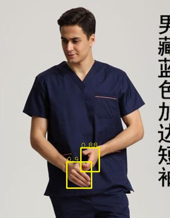
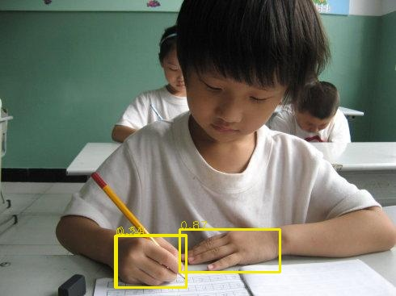
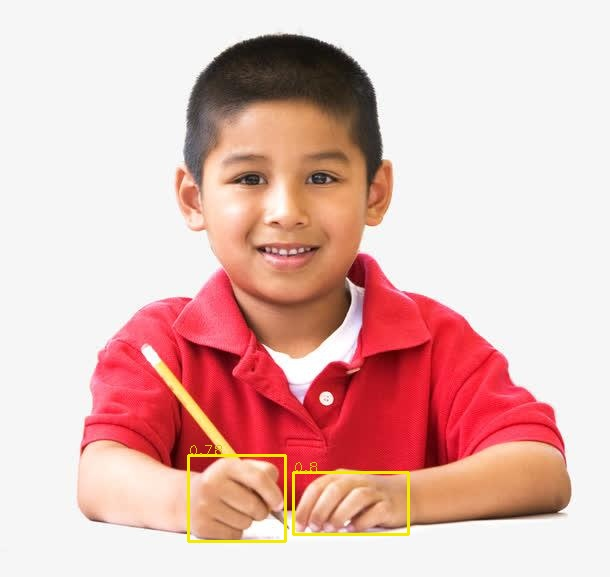
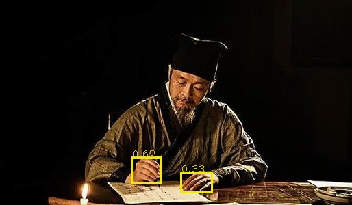
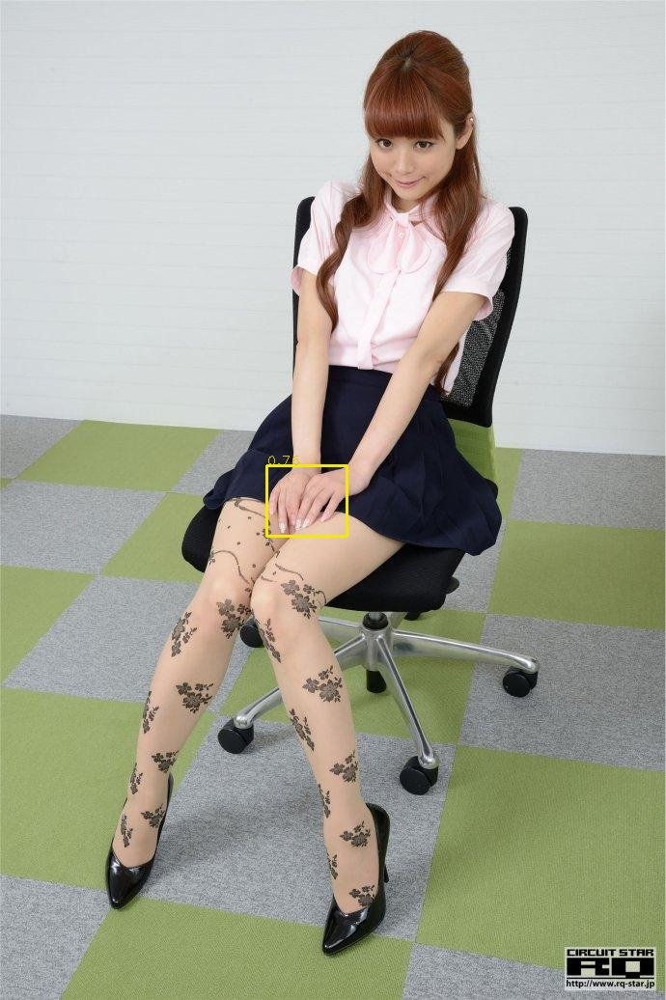
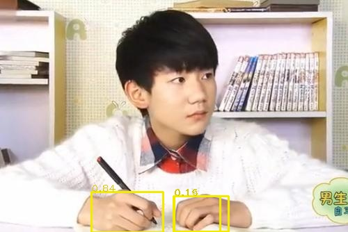

# hand-yolov5

hand detection using yolov5

### Install & Usage

Everything is same as [ultralytics/yolov5](https://github.com/ultralytics/yolov5)

```sh
cd hand-yolov5 && python setup.py install
cd .. && python demo.py
```

### Results









### Wishes

I wish anyone who see, hear or use this repo gain happiness and wisdom.